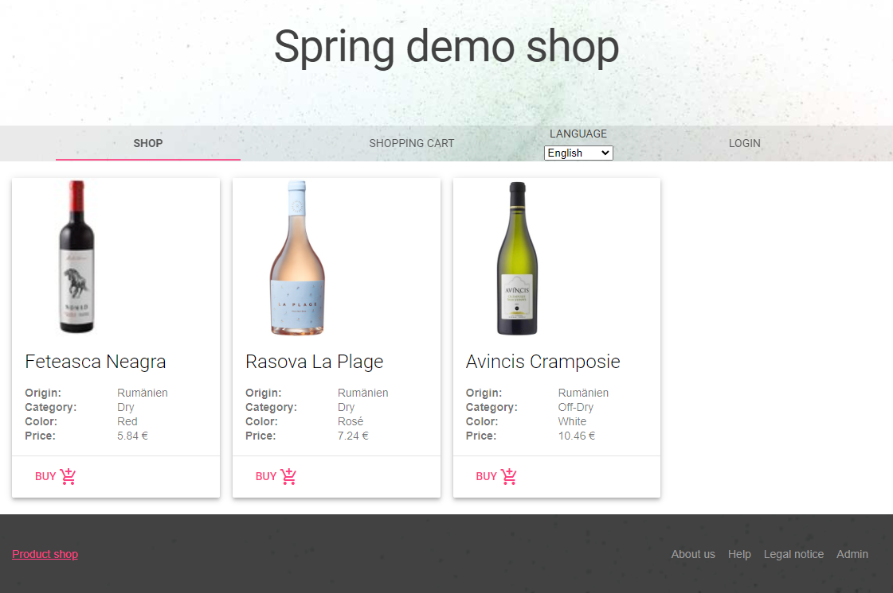

# Java / Spring course
This project is meant to teach Java and Spring fundamentals by creating a shop, step by step. It uses the [Java](https://en.wikipedia.org/wiki/Java_(programming_language)) programming language (version 8 and up), [Spring](https://spring.io/why-spring) framework, [Material Design Lite](https://getmdl.io) design and stores its data in a [MySQL](https://www.mysql.com/) / [MariaDB](https://mariadb.org) database.

The final application looks like this:
